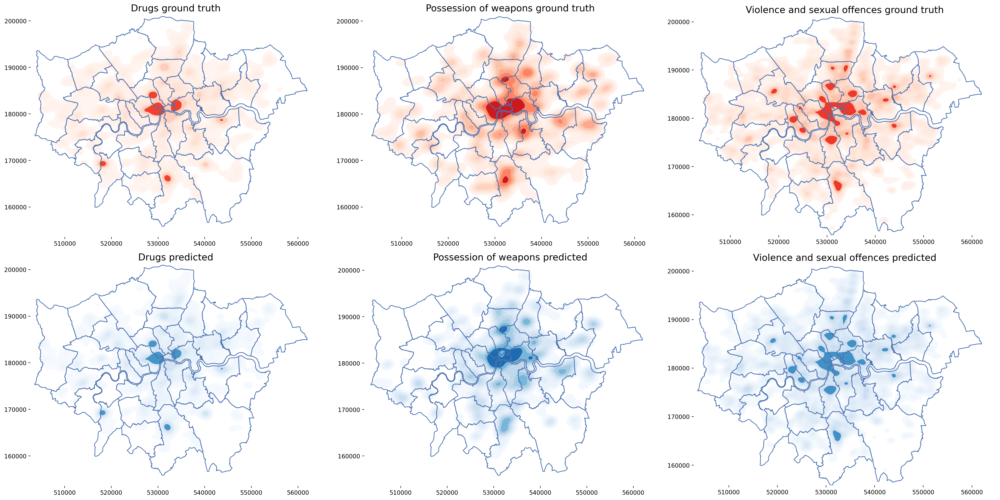

# Predicting Future Crime Hotspots in London Using Spatial-Temporal Information 
**Author:** Ruijie Jiang

**Institution:** Department of Informatics, King's College London


## Data Sources 
- [Historical crime data][1] in London from 01/2021 to 04/2022 provided by UK Police
- [Indices of Multiple Deprivation (IMD) 2019][2] by Office of National Statistics 
- [Covid-19 Community Mobility Report][3] by Google

## Project Environment
This project is completed in Python 3.8.10. Libraries requirements can be found at `requirements.txt`. 

## Project Structure
```
.
|-- data
|    |-- dataset
|       |-- Drugs
|       |-- Possession of weapons
|       |-- Violence and sexual offences
|    |-- London Crime
|    |-- statistical-gis-boundaries-london
|    |-- google_activity_by_london_Borough.csv
|    |-- IoD2019_Transformed_Scores.csv
|-- fig
|-- log
|-- results
|    |--drugs
|    |--violence
|    |--weapons
|-- feature_extract.py
|-- train.py
|-- pre_analysis.py
|-- result_vis.py
|-- utils.py
|-- hotspots.py
|-- importance.py
|-- roc.py
|-- merge.py
|-- train.sh
|-- README.md 
|-- requirements.txt
```
- Store the downloaded historical crime data in `London Crime` folder. Run `merge.py` to merge a csv file with all criminal records
- Data in `dataset` folder are the aggregated dataset for machine learning task
- All visualizations in this project are stored at `fig` folder
- `log` folder has the log files for feature extraction and machine learning classification
- `results` folder stores the classification results for each crime type
- `feature_extarct.py` is used to extract features from each data source and generate dataset for further machine learning task. Operations of data cleaning, feature extraction, dataset generation are stored here.
- `train.py` is used for machine learning classification.
- `pre_analysis.py` contains preliminary analysis before the machine learning task
- `result_vis` is used to analyze and visualize the results of machine learning classification
- `utils.py` contains utility functions in this project
- `hotspots.py` is used to compare the ground truth hotspots in London with the hotspots predicted by our best performing model.
- `importance.py` is used to identify the key features for hotspot prediction by computing the permutation feature importance.
- `roc.py` produces an example of ROC curve for our model
- `train.sh` is a bash file that containing all the commands ran by this project for machine learning

[1]:https://data.police.uk/data/
[2]:https://www.gov.uk/government/statistics/english-indices-of-deprivation-2019
[3]:https://www.google.com/covid19/mobility/
